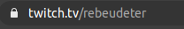

# Twitch chrome extension

A chrome extension that tells you when a twitch streamer is live using the twitch api with helix.

It not packaged so you have to enable developer mode in chrome to add it

The icons are not very clear, I just choose a streamer and turned black and white one of his photos

The html file is not necessary, if you get rid of the onclick listener in background.js and add page_action or popup nsit to index.html in the manifest it will showup and execute the scripts you referenced there.

9er3ej hna : https://developer.chrome.com/extensions/getstarted

You have to initialise these variable first :

- **Client_id:** you get that from your twitch account, it's private so don't publish it
- **Authkey:** same
- **User_login:** the user login of a twitch streamer, here it's "rebeudeter"

  

### TODO

- [x] Send you to the twitch channel on click
- [x] Change color when live,
  - [x] black and white → live off
  - [x] color → live on
- [ ] Chrome notification
  - [ ] Time when the live started
  - [ ] The title
  - [ ] The type [ irl, ]
- [ ] Firefox balak
  - [ ] che9wa
